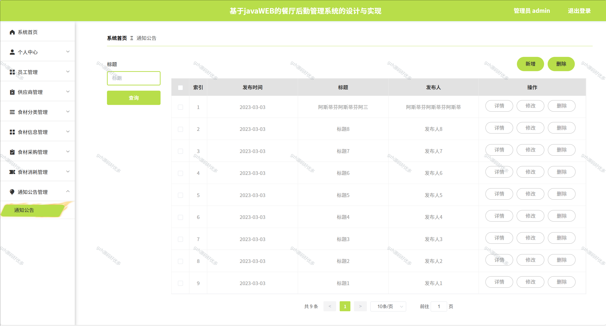

# springbootA222
springbootA222餐厅后勤管理系统
  
## 查看主页获取源码

### 一、关键词
餐厅后勤运营系统，餐厅供应链及后勤管理系统，餐饮后勤综合管理平台

### 二、作品包含
源码+数据库+全套环境和工具资源+本地部署教程

### 三、项目技术
前端技术：Html、Css、Js、Vue2.0、Element-ui 
后端技术：Java、SpringBoot2.0、MyBatis

### 四、运行环境（以下版本亲测，其他版本未知，请自测）
开发工具：IDEA/eclipse  + VSCODE

数据库：MySQL5.7（最低要5.7版本）

数据库管理工具：Navicat10以上版本

环境配置软件： JDK1.8 + Maven3.6.3

前端Nodejs：14

浏览器：谷歌浏览器

### 五、项目介绍
项目编号：springbootA222

餐厅后勤管理系统可整合食材采购、库存管控、成本核算、人员调度等后勤环节，实现高效协同与精细化管理，降低运营成本并提升服务效率。
 JavaWEB 的餐厅后勤管理系统，功能可概括为：

员工管理：增删查员工信息（工号、姓名等及照片、住址）。
供应商管理：增删查改供应商信息（账号、名称、联系方式等 ）。
食材分类管理：增删查改食材分类信息。
食材信息管理：增删查改食材信息（编号、名称、分类、数量等 ），可采购。
食材采购管理：增删查食材采购信息（编号、名称、类别、数量、金额等 ）。
食材消耗管理：增删查改食材消耗信息（编号、名称、类别、数量、使用说明等 ）。
通知公告管理：增删查改通知公告（标题、发布时间、发布人等 ）。
个人中心：修改登录密码、维护个人信息 。
系统首页：作为操作入口，快速跳转各功能模块 。

### 六、运行截图

 
